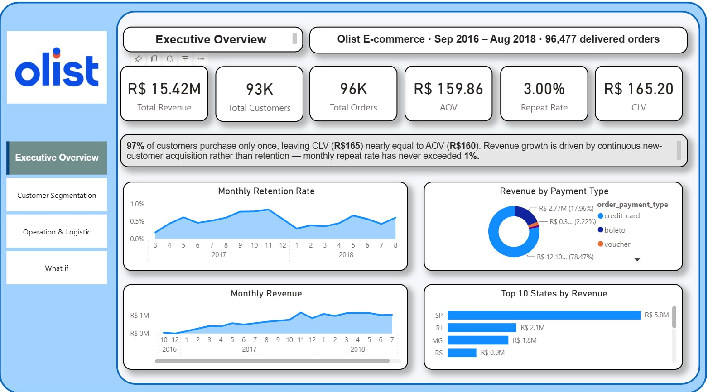
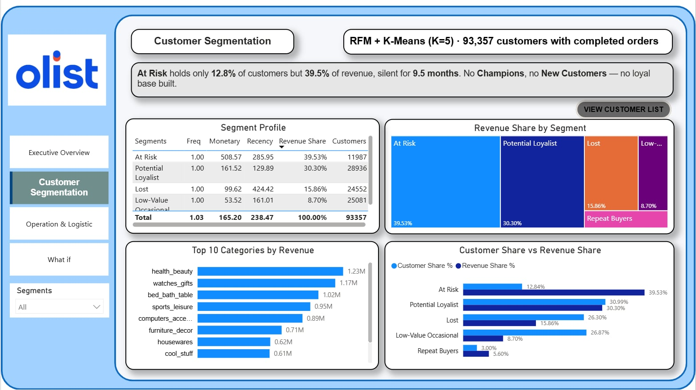
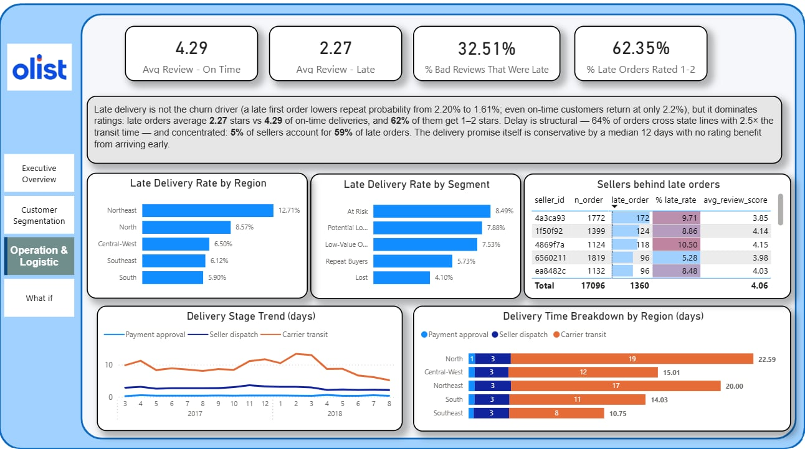
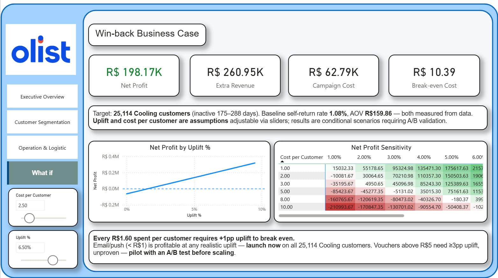
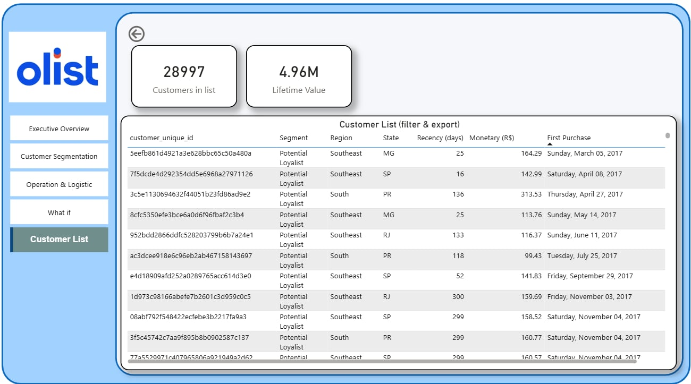
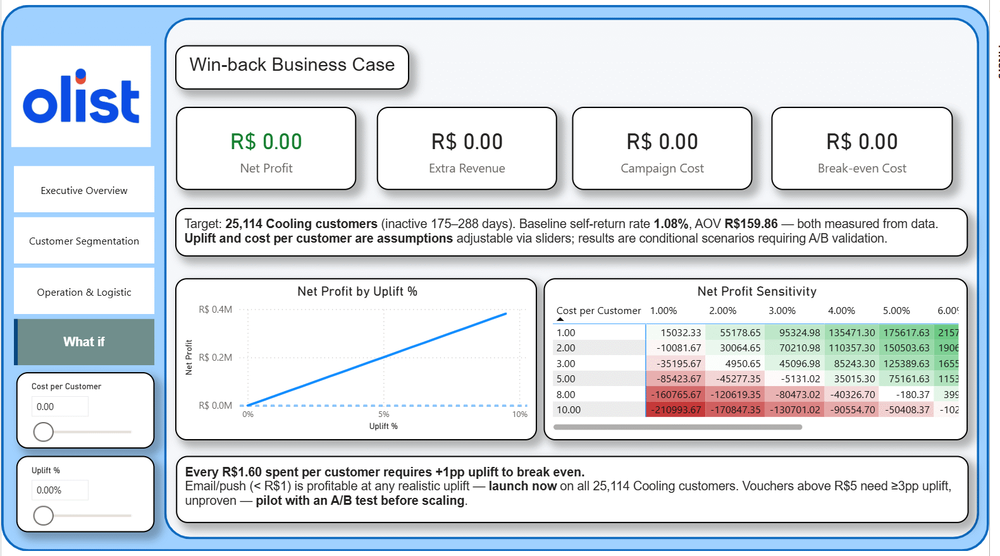
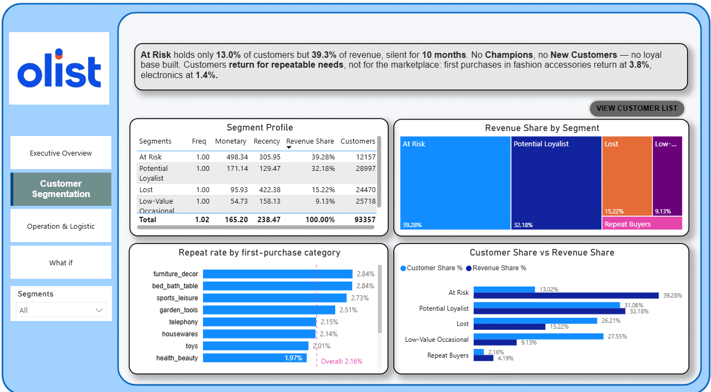

# Customer Lifecycle Optimization — RFM & K-Means on Olist E-commerce

> End-to-end analytics pipeline (PostgreSQL → Python → Power BI) investigating why 97.8% of Olist
> customers never return, and quantifying what it would cost to change that.

*Phiên bản tiếng Việt: [README_vi.md](README_vi.md)*

---

## 1. Business context & problem

[Olist](https://www.kaggle.com/datasets/olistbr/brazilian-ecommerce) is a Brazilian B2B2C marketplace
connecting small sellers to customers nationwide. This project analyses 96,477 successfully delivered
orders (Sep 2016 – Aug 2018) from 93,357 customers.

**The core problem:** Olist's customer lifetime value (R$165) is virtually identical to its average
order value (R$160). In a healthy retail business CLV is a multiple of AOV — customers come back.
Here they don't: only **2.16% of customers ever place a second purchase**, and monthly repeat rate
has never exceeded 1%. Revenue growth comes almost entirely from acquiring new customers, not from
retaining existing ones.

**Three questions this project answers:**

1. **Who are the customers, and which segment deserves investment?** (RFM + K-Means segmentation —
   `notebooks/01`)
2. **When is a customer actually lost, when should we intervene, and what is it worth?** (Survival
   analysis, lifecycle migration, business case simulation, A/B test design — `notebooks/02`)
3. **Why don't customers come back, and what can operations fix?** (First-order experience, logistics
   by region and seller, delivery promise, basket and next-purchase behaviour — `notebooks/03`)

---

## 2. Architecture

```
Kaggle CSV (9 files)
        │  COPY
        ▼
┌─────────────────────────────────────────────┐
│  PostgreSQL — olist_db                      │
│                                             │
│  BRONZE  9 raw tables (as-is from source)   │
│     │    cleaning + transformation in SQL   │
│     ▼                                       │
│  GOLD    Star schema — 4 dims, 3 facts      │
│          + 2 analysis outputs               │
└──────┬────────────────────────▲─────────────┘
       │ SQLAlchemy             │ to_sql()
       ▼                        │
┌──────────────────────────────────────┐
│  Python (Jupyter)                    │
│  RFM · K-Means · survival analysis   │
│  lifecycle migration · business case │
└──────────────────────────────────────┘
       │
       ▼  Import mode
┌──────────────────────────────────────┐
│  Power BI — 5-page dashboard         │
└──────────────────────────────────────┘
```

**Gold layer (star schema):** `dim_customers`, `dim_products`, `dim_sellers`, `dim_date` ·
`fact_orders` (grain: one order), `fact_order_items` (grain: one line item),
`fact_rfm_segments` (grain: one customer × one snapshot date). Notebook 03 adds two analysis outputs:
`fact_order_experience` (one order — purchase sequence, lateness, days early, cross-state, basket size)
and `dim_seller_performance` (one seller — order count, late rate, review, delivery days).

**Why two layers, not three:** The Medallion pattern typically has three layers — Bronze (raw),
Silver (cleaned), Gold (modelled for analysis). This project uses two: the cleaning steps that would
belong to Silver (filtering delivered orders, aggregating payments to order grain, deduplicating
reviews, resolving each customer to their most recent address) are performed inside the Bronze → Gold
load statements rather than materialised as a separate layer.

A dedicated Silver layer pays off when several Gold tables share the same cleaning logic, when
multiple sources need standardising before they can be joined, or when different teams own cleaning
and modelling. With one source and one analyst, an extra layer adds process without adding value.

---

## 3. Key findings

### 3.1 Only 2.16% of customers ever return — lower than the raw data suggests

A naive count of repeat customers gives 3.0%. Investigating an anomaly (25% of "second purchases"
occurred on the *same day* as the first) revealed these were **split orders**: a single checkout
divided into multiple `order_id`s when a basket contains items from different sellers. Verified at
timestamp level — the median gap between such orders is **1 second**, ruling out genuine repeat
behaviour.

After redefining a purchase as a distinct *purchase day*, real repeat customers drop from 2,801 to
**2,015 (2.16%)**. The retention problem is worse than the raw metric implies.

### 3.2 The industry-standard 90-day churn window misclassifies 45% of returning customers

Survival analysis on inter-purchase time shows that at the 90-day mark only **55%** of customers who
*will* return have returned. Two data-driven thresholds replace the convention:

| Threshold | Value | Use |
| :-- | :-- | :-- |
| Intervention window | ~175 days (P75) | When to trigger retention campaigns |
| Churned | ~288 days (P90) | When a customer is effectively lost |

These thresholds independently validate the K-Means output: the *At Risk* cluster averages 286 days
recency — precisely at the churn boundary the survival curve identifies.

### 3.3 39.5% of revenue sits in a segment that has already stopped buying

K-Means (K=5) segmentation on log-transformed, standardised RFM:

| Segment | Customers | Recency | Monetary | Share of revenue |
| :-- | --: | --: | --: | --: |
| At Risk | 11,987 (12.8%) | 286 d | R$508.57 | **39.5%** |
| Potential Loyalist | 28,936 (31.0%) | 130 d | R$161.52 | 30.3% |
| Lost | 24,552 (26.3%) | 424 d | R$99.62 | 15.9% |
| Low-Value Occasional | 25,081 (26.9%) | 161 d | R$53.52 | 8.7% |
| Repeat Buyers | 2,801 (3.0%) | 221 d | R$308.59 | 5.6% |

Two absences are as informative as the segments themselves: there is **no Champions segment**
(recent + frequent + high-value) and **no New Customers segment** — the most recent cluster still
averages 130 days since last purchase. Olist has not built a loyal customer base.

Traditional RFM scoring cannot separate the two most valuable groups: *At Risk* (7.08) and
*Potential Loyalist* (7.37) score almost identically, because a high monetary score compensates for
a low recency score. Together these two segments hold 69.8% of revenue and require opposite
strategies — which is precisely why clustering adds value over rule-based scoring.

### 3.4 Late delivery is not the churn driver — but it hits the highest-value segment hardest

Contrary to the initial hypothesis, the *Lost* segment has the **lowest** late-delivery rate (4.1%),
while *At Risk* — 39.5% of revenue — has the **highest** (8.5%).

Decomposing delivery time into three stages identifies the bottleneck precisely:

| Stage | Avg days | Share |
| :-- | --: | --: |
| Payment approval | 0.43 | 3.4% |
| Seller → carrier | 2.80 | 22.3% |
| **Carrier → customer** | **9.33** | **74.3%** |

Late orders take 31.5 days versus 10.9 for on-time orders, and **86.2% of that gap comes from carrier
transit**. Seller dispatch time is near-identical across all regions (2.68–2.88 days) while transit
varies 2.5× (Southeast 7.5 days vs North 19.3). Sellers are not the problem — long-distance carrier
logistics is. Transit is also the only stage improving: down from ~13 days in early 2018 to ~7 days
by August.

Two structural facts explain where the delay comes from. **64% of orders cross state lines** (sellers
cluster around São Paulo, customers do not), and those orders spend 11.9 days in transit versus 4.8
for in-state orders. Late orders are also concentrated: **5% of sellers account for 59% of all late
orders** — but the same sellers ship 50% of all orders, so the concentration follows volume, not
quality: only 9 sellers have a late rate above twice the average, and they cause under 5% of late
orders. A watch-list of ~100 high-volume sellers covers half of all late deliveries.

### 3.5 Customers almost never reactivate on their own

Tracking the same cohort across two snapshots six months apart: of 55,524 customers active at the
first snapshot, only **1.2% placed a new order** in the following six months. Lifecycle movement is
effectively one-directional (Engaged → Cooling → Dormant) with ~1% recovery at every stage.

### 3.6 A bad first order cuts the chance of a return by a quarter — a good one does not create it

Testing the churn hypothesis directly on first-purchase experience: customers whose first order was
rated 1–2 stars return at **1.72%**, versus **2.25%** for 4–5 stars; a late first delivery gives
**1.61%** versus **2.20%**. The effect is real but small. Even satisfied, on-time customers return at
2.2%, so fixing every delivery would move the repeat rate by a fraction of a point. Operations
protects revenue and ratings; it does not build loyalty.

Late delivery does, however, dominate ratings: late orders average **2.27 stars** versus 4.29, and
**62% of late orders receive 1–2 stars**. Seen from the other side, only **a third of 1–2 star
reviews are late orders** — two thirds of bad reviews come from on-time deliveries and point to
product or fulfilment problems that the delivery data cannot explain.

### 3.7 The delivery promise is ~12 days too conservative

Orders arrive a median **12 days before the promised date**; 79% arrive at least a week early.
Ratings are flat across early-delivery bands (4.20 for 1–7 days early, 4.31 for 8–14, 4.32 for 15+):
customers reward *not late*, not *extra early*. Olist could shorten the promise shown at checkout
substantially without touching ratings, provided the late rate is held — a second A/B test that the
framework in `notebooks/02` already covers.

### 3.8 Nothing to cross-sell inside the order — but a clear pattern in the next one

Only **3.3% of orders contain two distinct products** (1.3% involve two sellers), so basket analysis
and checkout cross-sell have no data to work with. The next purchase is where the signal is: among
the 2,015 repeat customers, **38% buy the same category again and 25% return to the same seller**.
The first-purchase category also predicts return: fashion bags & accessories 3.8%, furniture décor
and bed/bath 2.8–2.9%, versus electronics 1.4% and office furniture 1.5%. Customers come back for
repeatable needs, not for the marketplace.

---

## 4. Business recommendations

**Priority 1 — Win-back the Cooling segment (25,114 customers).** These customers are past the
intervention threshold but not yet churned. A simulation anchored on measured values (baseline
self-return rate 1.08%, AOV R$159.86) yields a simple decision rule:

> **Every R$1.60 spent per customer requires +1 percentage point of uplift to break even.**

Low-cost channels (email, push — under R$1 per customer) are profitable at any realistic uplift and
should be deployed immediately. Incentives above R$5 per customer require ≥3pp uplift, which is
unproven — pilot with an A/B test before scaling. The dashboard includes an interactive What-If
model and a sensitivity matrix covering the full cost × uplift decision space. Campaign content
should be personalised on the first purchase — same category or same seller (finding 3.8) — rather
than a generic discount.

**Priority 2 — Protect At Risk revenue and ratings through logistics.** The segment carrying 39.5%
of revenue receives the worst delivery experience. Since carrier transit rather than seller dispatch
is the proven bottleneck, priority shipping routes for high-value customers directly protect core
revenue. Operationally this means two lists: the ~100 high-volume sellers behind half of all late
orders (support, not penalties — their late rates are not extreme) and the Northeast, which has five
times North's volume at a similar late rate. This is a revenue-protection lever, not a retention
lever (finding 3.6).

**Priority 2b — Shorten the delivery promise.** With a median 12-day buffer and no rating benefit
from arriving early, the promised date shown at checkout can be tightened region by region, starting
with the Southeast where delivery variance is lowest.

**Priority 3 — Convert Potential Loyalists.** With no Champions segment in existence, this group
(31% of customers, 30.3% of revenue, most recent activity) is the only realistic path to building a
loyal base.

**Do not over-invest in Lost.** 26.3% of customers, 15.9% of revenue, 424 days silent, ~0.7%
reactivation rate. Restrict to large seasonal campaigns.

---

## 5. Dashboard

Five-page Power BI report. Interactive features: cross-page navigation, segment slicers,
drill-through to a filtered customer list, and What-If parameters driving a live business case model.

| Page | Purpose |
| :-- | :-- |
| Executive Overview | Business health: revenue, customers, AOV, CLV, retention trend, geography, payment mix |
| Customer Segmentation | Five segments, revenue concentration, category preferences, exportable customer list |
| Operations & Logistics | Delivery performance by segment and region, three-stage breakdown, trend |
| Win-back Business Case | What-If simulator with break-even analysis and cost × uplift sensitivity matrix |
| Customer List | Drill-through target — filtered, exportable list for campaign targeting |







### Interactive features

**What-If simulator** — dragging cost and uplift sliders recalculates net profit live; the card
switches colour at break-even and the sensitivity matrix maps the full decision space.



**Drill-through** — selecting a segment and opening the customer list produces a filtered,
exportable target list for campaign execution.



---

## 6. Tech stack & key decisions

**Stack:** PostgreSQL · Python (pandas, scikit-learn, statsmodels, SQLAlchemy) · Power BI

Decisions that materially affect the results:

| Decision | Rationale |
| :-- | :-- |
| Identify customers by `customer_unique_id` | `customer_id` is regenerated per order; using it would make every customer appear to buy exactly once |
| Aggregate payments to order grain before joining | Joining payments and items directly fans out revenue (verified: R$375.73 became R$751.46 on one order) |
| Two fact tables at different grains | Order-level facts for RFM and revenue; item-level for product and seller analysis |
| Analysis restricted to `delivered` orders | Cancelled and unavailable orders would distort monetary values |
| Snapshot date = last order date + 1 day | Using the current date would classify every customer as inactive for years |
| Log transform F and M, then StandardScaler | F and M are heavily right-skewed; MinMaxScaler would let a single R$13,664 customer compress everyone else |
| Outliers retained, not removed | High-spend customers are wholesale buyers, not data errors — removing them discards real revenue |
| K=5 chosen on business interpretability | Silhouette scores were statistically indistinguishable from K=3 onward; K=4 merged high-value active and high-value lapsed customers, which require opposite strategies |
| Churn thresholds from survival analysis | The 90-day convention misclassifies 45% of returning customers |
| Fixed thresholds for migration analysis | Re-clustering each period would produce false transitions when cluster boundaries shift |

---

## 7. How to reproduce

**Prerequisites:** PostgreSQL, Python 3.10+, Power BI Desktop.

1. Download the [Olist dataset](https://www.kaggle.com/datasets/olistbr/brazilian-ecommerce) into `data/raw/`.
2. Create database `olist_db`, then run in order:
   - `sql/01_bronze_schema.sql` — create raw tables, then import the CSVs
   - `sql/02_gold_schema.sql` — create the star schema
   - `sql/03_gold_schema_load.sql` — load dimensions and facts
3. Create a `.env` file in the project root (already listed in `.gitignore`, so credentials are never
   committed):
   ```
   DB_USER=postgres
   DB_PASSWORD=your_password
   DB_HOST=localhost
   DB_PORT=5432
   DB_NAME=olist_db
   ```
4. Run `notebooks/01_eda_rfm_kmeans.ipynb` — writes segments to `gold.fact_rfm_segments`.
5. Run the remaining SQL: `04_add_segment_to_dim.sql`, `05_add_region.sql`, `07_add_delivery_stages.sql`.
6. Validate with `sql/06_data_quality_checks.sql` — every check should return PASS.
7. Run `notebooks/02_advanced_analysis.ipynb` for survival, migration and business case analysis.
8. Run `notebooks/03_experience_operations_repeat.ipynb` — writes `gold.fact_order_experience` and
   `gold.dim_seller_performance`.
9. Open `powerbi/Olist_RFM_Dashboard.pbix`, update the data source credentials, and refresh.
   Use **View → Reading view** for full interactivity in Desktop.

---

## 8. Limitations & future work

**Data limitations**

- No marketing cost or COGS data — CLV is measured as revenue per customer, not profit, and
  customer acquisition cost cannot be calculated.
- No demographics or session data — segmentation is behavioural only.
- Data ends October 2018 — recommendations cannot be validated against outcomes.
- 2016 contains only 329 orders; the first months are excluded from trend analysis as the sample is
  too small to be meaningful.

**Methodological caveats**

- With 97.8% of customers buying once, Frequency carries almost no discriminating power. Clusters
  are effectively shaped by Recency and Monetary.
- Lifecycle migration percentages are sensitive to the churn threshold (34.8% to 50.8% across
  P85–P95). The qualitative conclusion holds at every threshold; the point estimate should not be
  quoted as precise. The threshold-free reactivation rate (1.2%) is used wherever a stable figure
  is required.
- Uplift in the business case is an assumption, not a measurement. The A/B test design in
  `notebooks/02` specifies how it would be validated.

**Future work**

- Churn prediction model (logistic regression on first-order attributes: review score, delivery
  delay, category, region).
- Text analysis of review comments: two thirds of 1–2 star reviews are not late deliveries, and 77%
  of 1-star reviews carry a written comment that could separate product, fulfilment and carrier issues.
- Migrate the SQL transformations to dbt for testing and lineage.

---

## Repository structure

```
├── data/raw/               Kaggle CSVs — not tracked; download per section 7
├── sql/
│   ├── 01_bronze_schema.sql           Raw table definitions
│   ├── 02_gold_schema.sql             Star schema (4 dims, 3 facts)
│   ├── 03_gold_schema_load.sql        Bronze → Gold transformation
│   ├── 04–05, 07                      Segment labels, regions, delivery stages
│   └── 06_data_quality_checks.sql     Reconciliation tests (row counts, orphan keys, PK integrity)
├── notebooks/
│   ├── 01_eda_rfm_kmeans.ipynb              RFM, K-Means, segment profiling
│   ├── 02_advanced_analysis.ipynb           Survival, migration, business case, A/B design
│   └── 03_experience_operations_repeat.ipynb First-order experience, logistics by region/seller,
│                                            delivery promise, basket and next purchase
├── powerbi/
│   ├── Olist_RFM_Dashboard.pbix
│   └── screenshots/                   Page captures and interaction demos
├── business_analysis.md    Business problems and hypotheses, verified baseline metrics, KPI definitions
├── README.md
└── README_vi.md            Vietnamese version
```
